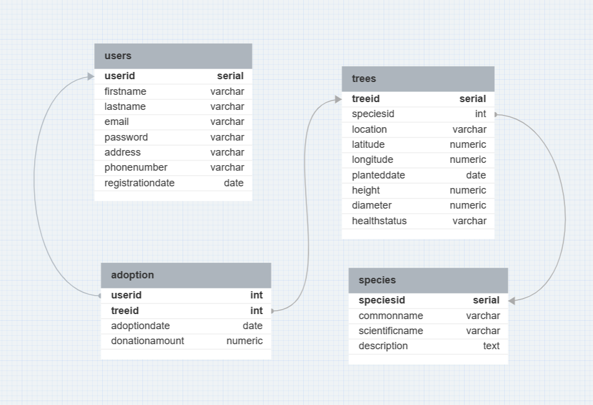

Certainly! Below is a basic template for your GitHub repository documentation. Feel free to customize it further based on your specific needs and details about your project.

---

# RunVerve

## Overview

RunVerve is a Flask-based web application that aims to promote environmental awareness and sustainability. It provides a platform for users to adopt and plant trees, contributing to a greener environment. The application also includes features such as user management, species information, and analytical dashboards.

## Contents

1. [Getting Started](#getting-started)
   - [Prerequisites](#prerequisites)
   - [Installation](#installation)
   - [Running the Application](#running-the-application)
   - [Accessing API Documentation](#accessing-api-documentation)
  
2. [Project Structure](#project-structure)

3. [API Endpoints](#api-endpoints)
   - [User Management](#user-management)
   - [Species](#species)
   - [Trees](#trees)
   - [Adoptions](#adoptions)
   - [Dashboard](#dashboard)

4. [Database Administration](#database-administration)

5. [Analytics](#analytics)

6. [Environment Variables](#environment-variables)

7. [Database Schema](#database-schema)

8. [Contributing](#contributing)

9. [License](#license)

## Getting Started

### Prerequisites

- Python 3.x
- PostgreSQL
- (Optional) Virtual environment (e.g., `virtualenv`)

### Installation

1. Clone the repository:

   ```bash
   git clone https://github.com/yourusername/RunVerve.git
   cd RunVerve
   ```

2. Install dependencies:

   ```bash
   pip install -r requirements.txt
   ```

### Running the Application

```bash
flask run
```

### Accessing API Documentation

- [Postman API Collection](https://runverve-task.postman.co/workspace/My-Workspace~c9c412c6-ebbf-4e89-8625-2ea3cb741f07/collection/27683202-013b9bb3-c743-42ea-901e-d495cd6de01a?action=share&creator=27683202)
- [API Documentation](https://documenter.getpostman.com/view/27683202/2s9YkraKNL)

## Project Structure

The project follows the structure outlined below:

- `app.py`: Flask application and API endpoints.
- `db_admin.py`: Database administration module.
- `db_analytics.py`: Analytics module for data insights.
- `db_conn.py`: Database connection module.
- `db_info.py`: Database schema and queries.
- `.flaskenv`: Configuration file for Flask environment variables.
- `static/`: Directory for static assets.
- `templates/`: HTML templates for Flask.

## API Endpoints

### User Management

- `POST /api/users`: Create a new user.
- `GET /api/users`: Get user information.

### Species

- `POST /api/species`: Create a new tree species.
- `GET /api/species`: Get information about tree species.

### Trees

- `POST /api/trees`: Plant a new tree.
- `GET /api/trees`: Get information about planted trees.

### Adoptions

- `POST /api/adoptions`: Adopt a tree.
- `GET /api/adoptions`: Get information about tree adoptions.

### Dashboard

- `GET /dashboard`: View analytical dashboard.

## Database Administration

- `db_admin.py`: Module for database administration tasks.

## Analytics

- `db_analytics.py`: Module for data analytics and visualization.

## Environment Variables

The application uses environment variables configured in `.flaskenv`. Key variables include:

- `FLASK_APP`: Flask application entry point.
- `FLASK_DEBUG`: Flask debug mode.
- `POSTMAN_API`: Postman API collection link.
- `POSTMAN_DOC`: Postman API documentation link.

## Database Schema



## Contributing

Contributions are welcome! Please follow the [Contribution Guidelines](CONTRIBUTING.md).

## License

This project is licensed under the [MIT License](LICENSE).

---

Feel free to add or modify sections based on the specific details of your project. Additionally, include a `CONTRIBUTING.md` file for contribution guidelines and a `LICENSE` file specifying the license for your project.

<!-- # RunVerve

## Overview

RunVerve is a Flask-based web application that aims to promote environmental awareness and sustainability. It provides a platform for users to adopt and plant trees, contributing to a greener environment. The application also includes features such as user management, species information, and analytical dashboards.

## Contents

1. [Getting Started](#getting-started)
   - [Prerequisites](#prerequisites)
   - [Installation](#installation)
   - [Running the Application](#running-the-application)
   - [Accessing API Documentation](#accessing-api-documentation)
  
2. [Project Structure](#project-structure)

3. [API Endpoints](#api-endpoints)
   - [User Management](#user-management)
   - [Species](#species)
   - [Trees](#trees)
   - [Adoptions](#adoptions)
   - [Dashboard](#dashboard)

4. [Database Administration](#database-administration)

5. [Analytics](#analytics)

6. [Environment Variables](#environment-variables)

7. [Contributing](#contributing)

8. [License](#license)

## Getting Started

### Prerequisites

- Python 3.x
- PostgreSQL
- (Optional) Virtual environment (e.g., `virtualenv`)

### Installation

1. Clone the repository:

   ```bash
   git clone https://github.com/yourusername/RunVerve.git
   cd RunVerve
   ```

2. Install dependencies:

   ```bash
   pip install -r requirements.txt
   ```

### Running the Application

```bash
flask run
```

### Accessing API Documentation

- [Postman API Collection](https://runverve-task.postman.co/workspace/My-Workspace~c9c412c6-ebbf-4e89-8625-2ea3cb741f07/collection/27683202-013b9bb3-c743-42ea-901e-d495cd6de01a?action=share&creator=27683202)
- [API Documentation](https://documenter.getpostman.com/view/27683202/2s9YkraKNL)

## Project Structure

The project follows the structure outlined below:

- `app.py`: Flask application and API endpoints.
- `db_admin.py`: Database administration module.
- `db_analytics.py`: Analytics module for data insights.
- `db_conn.py`: Database connection module.
- `db_info.py`: Database schema and queries.
- `.flaskenv`: Configuration file for Flask environment variables.
- `static/`: Directory for static assets.
- `templates/`: HTML templates for Flask.

## API Endpoints

### User Management

- `POST /api/users`: Create a new user.
- `GET /api/users`: Get user information.

### Species

- `POST /api/species`: Create a new tree species.
- `GET /api/species`: Get information about tree species.

### Trees

- `POST /api/trees`: Plant a new tree.
- `GET /api/trees`: Get information about planted trees.

### Adoptions

- `POST /api/adoptions`: Adopt a tree.
- `GET /api/adoptions`: Get information about tree adoptions.

### Dashboard

- `GET /dashboard`: View analytical dashboard.

## Database Administration

- `db_admin.py`: Module for database administration tasks.

## Analytics

- `db_analytics.py`: Module for data analytics and visualization.

## Environment Variables

The application uses environment variables configured in `.flaskenv`. Key variables include:

- `FLASK_APP`: Flask application entry point.
- `FLASK_DEBUG`: Flask debug mode.
- `POSTMAN_API`: Postman API collection link.
- `POSTMAN_DOC`: Postman API documentation link.

## Contributing

Contributions are welcome! Please follow the [Contribution Guidelines](CONTRIBUTING.md).

## License

This project is licensed under the [MIT License](LICENSE).

---

Feel free to add or modify sections based on the specific details of your project. Additionally, include a `CONTRIBUTING.md` file for contribution guidelines and a `LICENSE` file specifying the license for your project. -->